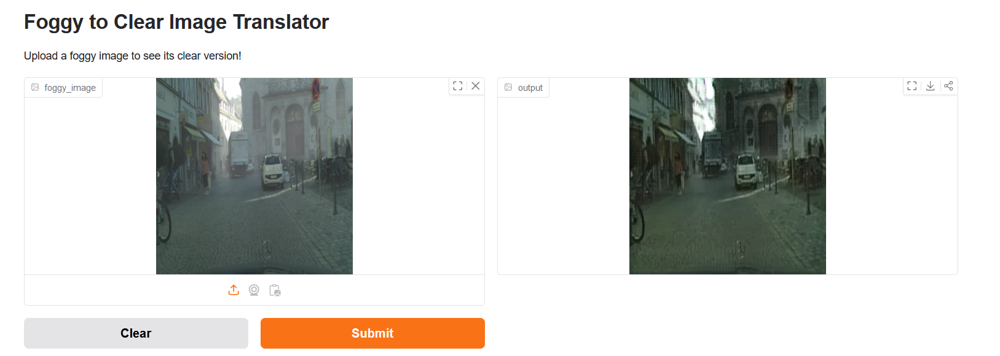
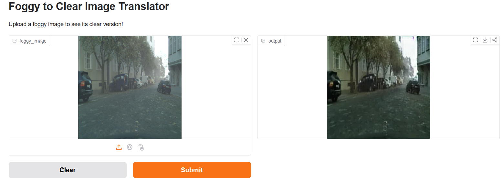
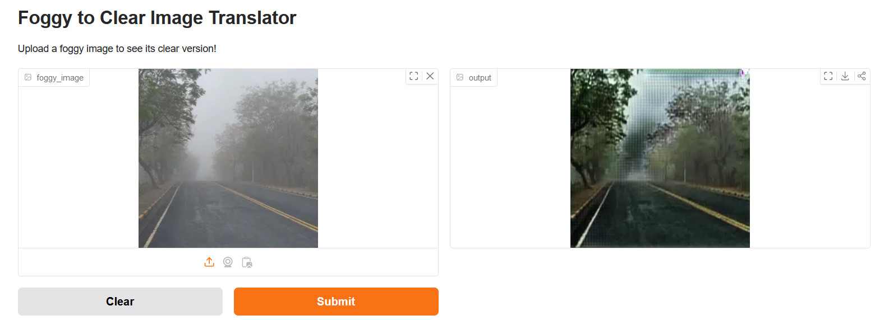
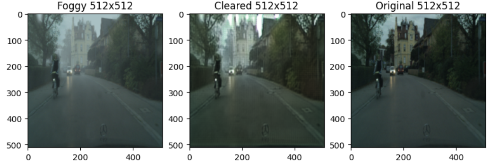
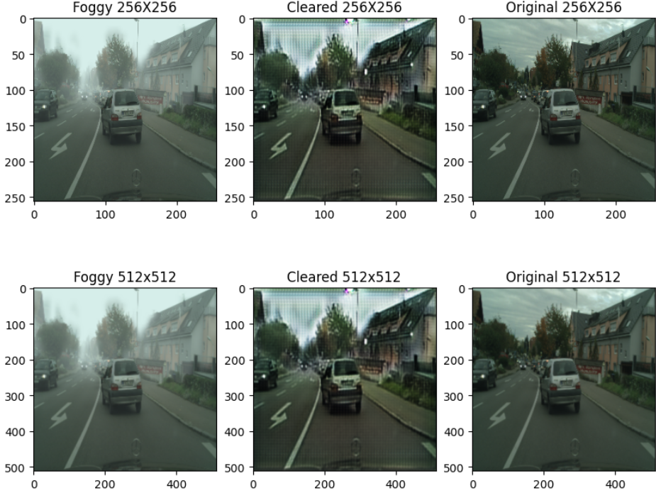

# Foggy Image Enhancement
This project aims to convert foggy images to clear images using <b>Generative Adversarial Networks (GAN)</b>. It was built as part of my B.tech project.

The datasets used to train the model was the [Foggy CityScapes](https://people.ee.ethz.ch/~csakarid/SFSU_synthetic/) dataset (for foggy images)and the [CityScapes](https://www.cityscapes-dataset.com/) dataset (for clear images). The foggy images used in this project had a visibility of 300m.

This problem was tackled as an image reconstruction problem and a <b>CycleGAN</b> was trained on about 500 images from this dataset. The models were trained on Google Colab and it was evaluated based on Peak Signal to Noise Ratio (PSNR) and Structural Similarity Index (SSIM).

The trained model was deployed on HuggingFace Spaces. Some of the results can be seen in the below section.

## Screenshots

## Results
Evaluation on the validation set consisting of about 60 images gave a PSNR of 20.05 and SSIM of 0.7878 which is very promising.

### Notes
The results still have scope for improvement and the results can definitely improve further. Training this model was still a great learning experience to learn about GANs.
